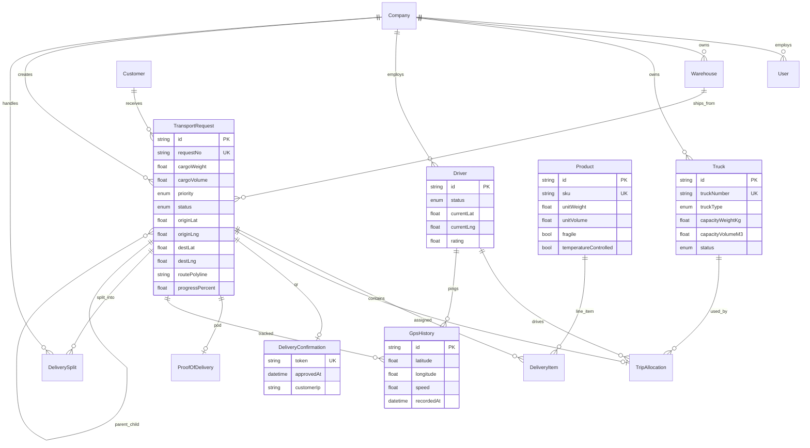

# Enterprise TMS — Database ERD

## Key Relationships

| From | To | Cardinality | Description |
|------|-----|-------------|-------------|
| TransportRequest | DeliveryItem | 1:N | Product line items |
| TransportRequest | TripAllocation | 1:1 | Truck + driver assignment |
| TransportRequest | DeliverySplit | 1:N | Shinwa vs subcontractor cargo |
| Driver | GpsHistory | 1:N | 30-second GPS pings |
| TransportRequest | DeliveryConfirmation | 1:1 | QR customer approval |
