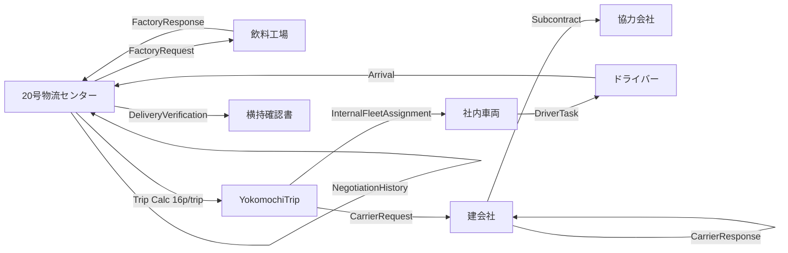

# Information Flow — Key Coffee Yokomochi

```mermaid
flowchart LR
  WH[20号物流センター] -->|FactoryRequest| FC[飲料工場]
  FC -->|FactoryResponse| WH
  WH -->|NegotiationHistory| WH
  WH -->|Trip Calc 16p/trip| TR[YokomochiTrip]
  TR -->|InternalFleetAssignment| IF[社内車両]
  TR -->|CarrierRequest| CR[建会社]
  CR -->|CarrierResponse| CR
  CR -->|Subcontract| SUB[協力会社]
  IF -->|DriverTask| DR[ドライバー]
  DR -->|Arrival| WH
  WH -->|DeliveryVerification| DC[横持確認書]
```

## Data Persistence Rules

- All orders kept forever (`createdAt DESC`)
- Negotiation history append-only
- No hard deletes on YokomochiOrder
